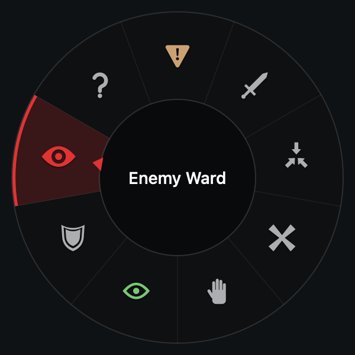
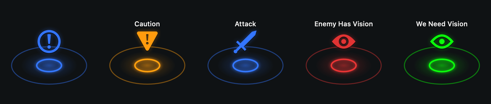
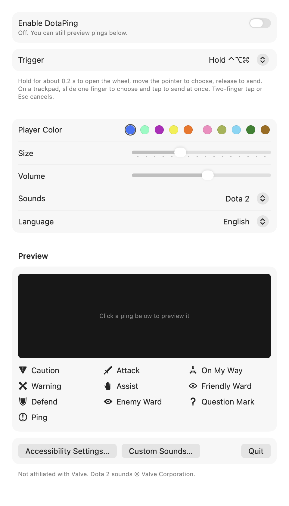
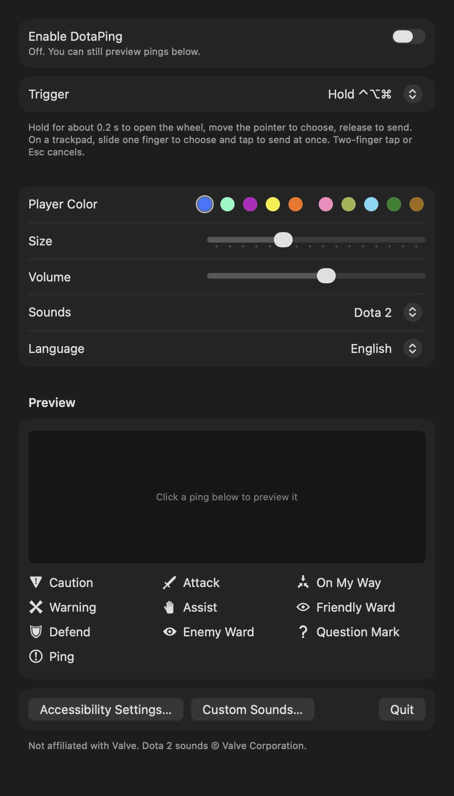

# DotaPing

[简体中文](README.zh-CN.md)

A small macOS menu-bar app that puts Dota 2's ping wheel on the desktop. Hold a shortcut (or ⌥-click, as in the game), point at a ping, let go, and it lands where you started with an animation and a sound. Works with a mouse or a trackpad. It plays the game's original ping sounds, and the interface is in English by default and can be switched to Simplified Chinese.

DotaPing is based on **[AllenTHT/LoLPing-Mac](https://github.com/AllenTHT/LoLPing-Mac)**, which does the same for League of Legends smart pings. The app structure, the modifier-chord gesture state machine, the overlay windows and the self-check tooling are adapted from that project. The Dota 2 ping set, icons, sounds, trackpad handling, ⌥-click trigger and bilingual interface are new.

<p align="center">
  
</p>
<p align="center">
  
</p>
<p align="center">
  
  
</p>

## Requirements

Apple Silicon Mac with macOS 13 or later.

## Install

Download `DotaPing-v1.2.0-macOS-arm64.zip` from [Releases](https://github.com/PeixiongYuan/DotaPing-Mac/releases), unzip it and move `DotaPing.app` to Applications.

The app is ad-hoc signed, not notarized. If macOS refuses to open it, try once, then go to **System Settings → Privacy & Security** and choose **Open Anyway**.

Turn on **Enable DotaPing** and allow DotaPing under **System Settings → Privacy & Security → Accessibility**. The global shortcut needs this permission; the in-window preview does not.

## Build from source

Needs the Command Line Tools (`xcode-select --install`). No Xcode, packages or network access.

```sh
zsh scripts/build.sh   # builds and ad-hoc signs dist/DotaPing.app
zsh scripts/test.sh    # gesture, data, language, icon and audio checks
```

The scripts call `swiftc` directly. `Package.swift` is kept for Xcode and `swift build`. If `swift build` fails with `Invalid manifest` / `Undefined symbols … Package.__allocating_init`, your Command Line Tools have stale `*.private.swiftinterface` files under `usr/lib/swift/pm/ManifestAPI/`; reinstalling them fixes it, and the scripts work either way.

## Usage

| Trigger | How it works |
| --- | --- |
| **Hold ⌃⌥⌘** (default; ⌃⌥⇧ and ⌃⌘⇧ also available) | Hold for about 0.2 s to open the wheel, move the pointer, release any key to send. While the wheel is open a click or trackpad tap sends immediately. No mouse button needed. |
| **⌥ + Left Click** (as in the game) | ⌥-click sends a Ping, ⌃⌥-click sends a Warning, ⌥ + hold and drag opens the wheel and sends on release. While this trigger is on, ⌥-clicks belong to DotaPing. |

Esc or a right-click cancels. The ping lands where the wheel was opened, even when the wheel is pushed in from a screen edge. Closing the window keeps the app in the menu bar.

Settings are saved automatically: trigger, player color, size, volume, sounds and language (**Language / 语言**, English by default). The app adds no login item, makes no network requests and does not record what you type.

### Trackpad

- With a held shortcut, slide one finger to choose; there is no need to press the trackpad. Lift the keys or tap to send.
- With ⌥ + Left Click, tap (with Tap to Click) or click for a Ping; press and keep the finger down to open the wheel, then slide and lift. Three-finger drag also works.
- A two-finger tap (secondary click) cancels.
- Two-finger scrolling and momentum scrolling never cancel the wheel, and do not scroll the window underneath while it is open.

## Pings

Nine slots of 40°, clockwise from the top, with the ordinary Ping in the center. Names, team chat lines, fixed colors and sound grouping come from the game's `scripts/ping_wheel.vdata` and its English and Simplified Chinese localization.

| Slot | Ping | Chat line | 简体中文 | Color | Game sound event |
| --- | --- | --- | --- | --- | --- |
| Top | Caution | Caution | 小心 | fixed orange | General.PingWarning |
| 40° | Attack | Attack | 进攻 | player color | General.PingAttack |
| 80° | On My Way | On My Way | 我马上到 | player color | General.PingWaypoint |
| 120° | Warning | — | 警告 | player color | General.PingWarning |
| 160° | Assist | Assist | 援助 | player color | General.Ping |
| 200° | Friendly Ward | We Need Vision | 友方守卫 | fixed green | General.PingFriendlyWard |
| 240° | Defend | Defend | 防守 | player color | General.PingDefense |
| 280° | Enemy Ward | Enemy Has Vision | 敌方守卫 | fixed red | General.PingEnemyWard |
| 320° | Question Mark | — | 问号 | player color | General.Ping |
| Center | Ping | — | 信号 | player color | General.Ping |

The player color can be any of the ten Radiant and Dire slot colors. Question Mark is the game's "Question Mark?" seasonal ping; it has no sound event or chat line of its own, so it uses the ordinary ping sound. The game lets players rearrange the wheel; the order above follows LoLPing's layout, with Question Mark added last, and may differ from the in-game default. The Heart ping is not included.

## Icons and sound

- The icons are vector drawings that follow the shapes of the in-game ping icons where those could be checked: the ringed "!", the flared X, three converging arrows for On My Way, the sword, the notched shield, the ward eye and the bold question mark. In game both ward pings use the same eye in different colors; here Friendly Ward is drawn as an outline so the two differ even before they are highlighted. The standard Caution and Assist icons are not publicly available, so Caution is a point-down warning triangle (after the game's "Caution!" seasonal ping) and Assist is a raised hand.
- **Sounds → Dota 2** (default) plays the game's own ping sounds. The eight files from the game's `sounds/ui/` folder are bundled unmodified in `Resources/Sounds/`, taken from the community archive [Source2Sounds/dota2](https://github.com/Source2Sounds/dota2) at a pinned commit; `Resources/asset-sources.json` records their sources and SHA-256 hashes, and `scripts/fetch_sounds.py` can restore them. At launch DotaPing mixes them the way the game's sound events do: per-event volume, plus the extra layer under Warning (pitch 1.25) and Attack (pitch 0.95, 0.1 s late). **These sound files are © Valve Corporation** and are included, as in LoLPing-Mac, for this fan-made tool only.
- **Sounds → Synthesized** plays seven cues generated at launch instead (`Sources/PingCore/SoundSynth.swift`).
- To use your own sounds, click **Custom Sounds…** to open `~/Library/Application Support/DotaPing/Sounds/` and add files named `ping`, `ping_warning`, `ping_waypoint`, `ping_attack`, `ping_enemy_ward`, `ping_friendly_ward` or `ping_defense` (wav, mp3, m4a, aiff or caf). They apply on the next ping.
- The landing animation is rebuilt in AppKit from the minimap ping parameters in `ping_wheel.vdata`: a ring that closes in over 0.3 s and pulses, outward pulses, the icon rising with the team chat line above it, then a fade. It is a reconstruction in the same spirit, not a frame-accurate copy.

## Self-checks

```sh
dist/DotaPing.app/Contents/MacOS/DotaPing --check-assets
dist/DotaPing.app/Contents/MacOS/DotaPing --visual-check "$PWD/Verification/Visuals"
dist/DotaPing.app/Contents/MacOS/DotaPing --export-sounds /tmp/dotaping-sounds
```

`--visual-check` uses the app's own renderer to write wheel snapshots at 75/100/150 % (Retina and 1x), animation phases, all ten player colors, the settings window in light and dark appearance and in both languages, and a short silent demo video. It also checks that every animation changes over time, clears completely when it ends and disappears immediately when stopped. It creates no event tap, writes no preferences and does not capture the screen.

`scripts/test.sh` runs 30 scenarios (277 assertions) over the gesture state machine and data: every wheel slot and the center zone, every key-release order, repeats, cancels, extra modifiers, drags already in progress, negative multi-display coordinates, trackpad tap-to-confirm, ⌥-click / ⌥-drag / ⌃⌥-click, swallowed releases after a cancel, both language tables, icon bounds, synthesized audio, WAV encoding, the game-sound mixing and the bundled files' checksums. Live global input, real trackpad gestures, external displays and full-screen apps still need checking on hardware; see [VERIFICATION.md](VERIFICATION.md).

## Credits

- [AllenTHT/LoLPing-Mac](https://github.com/AllenTHT/LoLPing-Mac): the project DotaPing is based on.
- [SteamDatabase/GameTracking-Dota2](https://github.com/SteamDatabase/GameTracking-Dota2): reference for `ping_wheel.vdata`, the ping wheel stylesheet and the English localization. Only text, color values and timings were used.
- [Liquipedia](https://liquipedia.net/dota2/): its Dota 2 image archive was a visual reference for the icon shapes. No images were copied.
- [Source2Sounds/dota2](https://github.com/Source2Sounds/dota2): source of the bundled ping sound files.

No license has been chosen yet. Parts of the code are adapted from LoLPing-Mac, which does not state a license. The files in `Resources/Sounds/` belong to Valve and are not covered by any license of this project.

DotaPing is an independent project and is not affiliated with or endorsed by Valve. Dota 2 is a trademark of Valve Corporation.
