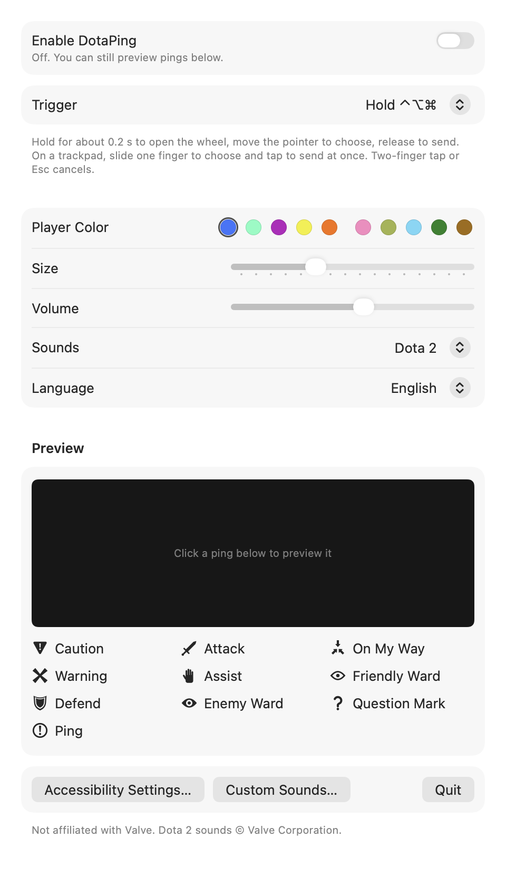
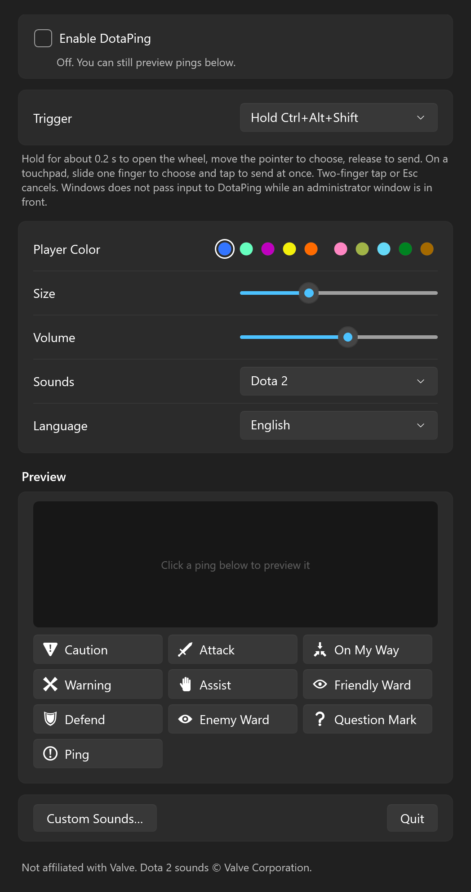

# DotaPing

[简体中文](README.zh-CN.md)

A small menu-bar and tray app for **macOS and Windows** that puts Dota 2's ping wheel on the desktop. Hold a shortcut (or Alt/⌥-click, as in the game), point at a ping, let go, and it lands where you started with an animation and a sound. Works with a mouse or a trackpad. It plays the game's original ping sounds, and the interface is in English by default and can be switched to Simplified Chinese.

DotaPing is based on **[AllenTHT/LoLPing-Mac](https://github.com/AllenTHT/LoLPing-Mac)**, which does the same for League of Legends smart pings. The macOS app's structure, the modifier-chord gesture state machine, the overlay windows and the self-check tooling are adapted from that project. The Dota 2 ping set, icons, sounds, trackpad handling, Alt/⌥-click trigger, bilingual interface and the Windows version are new.

<p align="center">
  
</p>
<p align="center">
  
</p>
<p align="center">
  
  
</p>

## Download

From [Releases](https://github.com/PeixiongYuan/DotaPing-Mac/releases):

| | File | Requirements |
| --- | --- | --- |
| macOS | `DotaPing-v1.4.0-macOS-arm64.zip` | Apple Silicon, macOS 13 or later |
| Windows | `DotaPing-v1.4.0-windows-x64.zip` | Windows 10 or 11 (x64; runs on Arm through emulation). Nothing else to install. |

### macOS

Unzip and move `DotaPing.app` to Applications. The app is signed with the project's own self-signed certificate and is not notarized: if macOS refuses to open it, try once, then go to **System Settings → Privacy & Security** and choose **Open Anyway**.

Turn on **Enable DotaPing** and allow DotaPing under **System Settings → Privacy & Security → Accessibility**. The global shortcut needs this permission; the in-window preview does not.

**Updating keeps the permission from 1.3.0 on.** macOS remembers Accessibility access by the app's code requirement. Up to 1.2.0 the app was ad-hoc signed, so that requirement was the binary's hash and every new version had to be removed and allowed again. Since 1.3.0 every release is signed with the same certificate, and the requirement is "bundle identifier `local.dotaping.DotaPing`, signed by this certificate", which later versions also meet. When coming from 1.2.0 or earlier, remove the old DotaPing entry and allow it once more; after that, just replace the app.

### Windows

Unzip and run `DotaPing.exe` (a single self-contained file, about 70 MB because it carries its own .NET runtime). It is not code-signed, so SmartScreen may say "Windows protected your PC": choose **More info → Run anyway**. DotaPing runs in the notification area; click its icon for settings. No administrator rights or permission prompts are needed, and it is on from the first start.

- Windows does not pass keyboard and mouse input to a normal app while a window running **as administrator** is in front, so DotaPing cannot see the shortcut there.
- The overlay appears above normal and borderless-fullscreen windows. Games in **exclusive fullscreen** draw above it; use borderless or windowed mode.
- Settings are stored in `%APPDATA%\DotaPing\settings.json`.

## Usage

| Trigger | macOS | Windows | How it works |
| --- | --- | --- | --- |
| Held shortcut (default) | ⌃⌥⌘ (or ⌃⌥⇧, ⌃⌘⇧) | Ctrl+Alt+Shift (or Ctrl+Alt) | Hold for about 0.2 s to open the wheel, move the pointer, release any key to send. While the wheel is open a click or trackpad tap sends immediately. No mouse button needed. |
| As in the game | ⌥ + Left Click | Alt + Left Click | Alt/⌥-click sends a Ping, Ctrl/⌃ + Alt/⌥-click sends a Warning, Alt/⌥ + hold and drag opens the wheel and sends on release. While this trigger is on, those clicks belong to DotaPing. |

Esc or a right-click cancels. The ping lands where the wheel was opened, even when the wheel is pushed in from a screen edge. Closing the window keeps the app in the menu bar or notification area.

Settings are saved automatically: trigger, player color, size, volume, sounds and language (**Language / 语言**, English by default). The app adds no login item, makes no network requests and does not record what you type.

### Trackpad and touchpad

- With a held shortcut, slide one finger to choose; there is no need to press the pad. Lift the keys or tap to send.
- With Alt/⌥ + Left Click, tap or click for a Ping; press and keep the finger down to open the wheel, then slide and lift. On a Mac, three-finger drag also works.
- A two-finger tap (secondary click) cancels.
- Two-finger scrolling and momentum scrolling never cancel the wheel, and do not scroll the window underneath while it is open.
- On Windows, holding Alt while a click is taken by DotaPing would normally open the menu bar of the app below when Alt is released; DotaPing sends an unassigned key in between to prevent that.

## Pings

Nine slots of 40°, clockwise from the top, with the ordinary Ping in the center. Names, team chat lines, fixed colors and sound grouping come from the game's `scripts/ping_wheel.vdata` and its English and Simplified Chinese localization.

| Slot | Ping | Chat line | 简体中文 | Color | Game sound event |
| --- | --- | --- | --- | --- | --- |
| Top | Caution | Caution | 小心 | fixed orange | General.PingWarning |
| 40° | Attack | Attack | 进攻 | player color | General.PingAttack |
| 80° | On My Way | On My Way | 我马上到 | player color | General.PingWaypoint |
| 120° | Warning | — | 警告 | player color | General.PingWarning |
| 160° | Assist | Assist | 援助 | player color | General.Ping |
| 200° | Friendly Ward | We Need Vision | 友方守卫 | fixed green | General.PingFriendlyWard |
| 240° | Defend | Defend | 防守 | player color | General.PingDefense |
| 280° | Enemy Ward | Enemy Has Vision | 敌方守卫 | fixed red | General.PingEnemyWard |
| 320° | Question Mark | — | 问号 | player color | General.Ping |
| Center | Ping | — | 信号 | player color | General.Ping |

The player color can be any of the ten Radiant and Dire slot colors. Question Mark is the game's "Question Mark?" seasonal ping; it has no sound event or chat line of its own, so it uses the ordinary ping sound. The game lets players rearrange the wheel; the order above follows LoLPing's layout, with Question Mark added last, and may differ from the in-game default. The Heart ping is not included.

## Icons and sound

- The icons are vector drawings that follow the shapes of the in-game ping icons where those could be checked: the ringed "!", the flared X, three converging arrows for On My Way, the sword, the notched shield, the ward eye and the bold question mark. In game both ward pings use the same eye in different colors; here Friendly Ward is drawn as an outline so the two differ even before they are highlighted. The standard Caution and Assist icons are not publicly available, so Caution is a point-down warning triangle (after the game's "Caution!" seasonal ping) and Assist is a raised hand. Both apps draw the same outlines: the Windows build uses `windows/Core/glyphs.json`, exported from the macOS app with `--export-glyphs`.
- **Sounds → Dota 2** (default) plays the game's own ping sounds. The eight files from the game's `sounds/ui/` folder are bundled unmodified in `Resources/Sounds/`, taken from the community archive [Source2Sounds/dota2](https://github.com/Source2Sounds/dota2) at a pinned commit; `Resources/asset-sources.json` records their sources and SHA-256 hashes, and `scripts/fetch_sounds.py` can restore them. At launch DotaPing mixes them the way the game's sound events do: per-event volume, plus the extra layer under Warning (pitch 1.25) and Attack (pitch 0.95, 0.1 s late). **These sound files are © Valve Corporation** and are included, as in LoLPing-Mac, for this fan-made tool only.
- **Sounds → Synthesized** plays seven cues generated at launch instead.
- To use your own sounds, click **Custom Sounds…** and add files named `ping`, `ping_warning`, `ping_waypoint`, `ping_attack`, `ping_enemy_ward`, `ping_friendly_ward` or `ping_defense`. The folder is `~/Library/Application Support/DotaPing/Sounds/` on macOS (wav, mp3, m4a, aiff, caf) and `%APPDATA%\DotaPing\Sounds\` on Windows (wav, mp3, m4a, wma). They apply on the next ping.
- The landing animation is rebuilt from the minimap ping parameters in `ping_wheel.vdata`: a ring that closes in over 0.3 s and pulses, outward pulses, the icon rising with the team chat line above it, then a fade. It is a reconstruction in the same spirit, not a frame-accurate copy.

## Build from source

### macOS

Needs the Command Line Tools (`xcode-select --install`). No Xcode, packages or network access.

```sh
zsh scripts/build.sh   # builds and signs dist/DotaPing.app
zsh scripts/test.sh    # gesture, data, language, icon and audio checks
```

On first run `scripts/build.sh` creates a self-signed code-signing identity in `.signing/` (its own keychain file, ignored by git; the login keychain and trust settings are not touched) and signs every later build with it, so your own builds also keep the Accessibility permission. Keep that folder: a new identity means allowing the app once more.

The scripts call `swiftc` directly. `Package.swift` is kept for Xcode and `swift build`. If `swift build` fails with `Invalid manifest` / `Undefined symbols … Package.__allocating_init`, your Command Line Tools have stale `*.private.swiftinterface` files under `usr/lib/swift/pm/ManifestAPI/`; reinstalling them fixes it, and the scripts work either way.

### Windows

Needs the .NET 10 SDK. From the repository root:

```sh
dotnet run --project windows/Checks
dotnet publish windows/App/DotaPing.csproj -c Release -r win-x64 --self-contained true -p:PublishSingleFile=true -p:IncludeNativeLibrariesForSelfExtract=true -p:EnableCompressionInSingleFile=true -o publish
```

`windows/Core` holds the shared logic ported from the macOS `PingCore` (gesture state machine, ping data, both languages, WAV and mixing, synthesized cues), `windows/Checks` its tests, and `windows/App` the WPF app: low-level keyboard and mouse hooks, click-through overlay windows, the tray icon and a settings window in the system's Fluent theme. The [Windows workflow](.github/workflows/windows.yml) builds and tests every push to main on a Windows runner and attaches the zip to each release.

## Self-checks

macOS:

```sh
dist/DotaPing.app/Contents/MacOS/DotaPing --check-assets
dist/DotaPing.app/Contents/MacOS/DotaPing --visual-check "$PWD/Verification/Visuals"
dist/DotaPing.app/Contents/MacOS/DotaPing --export-sounds /tmp/dotaping-sounds
```

Windows (`DotaPing.exe` is a GUI program; run it with `Start-Process -Wait -RedirectStandardOutput` to see the output):

```sh
DotaPing.exe --check-assets
DotaPing.exe --visual-check visuals
DotaPing.exe --input-self-test
```

`--visual-check` uses each app's own renderer to write wheel snapshots, animation phases, all ten player colors and the settings window in light and dark appearance and in both languages (plus a short demo video on macOS). It also checks that every animation changes over time, clears completely when it ends and disappears immediately when stopped. It creates no input hooks, writes no preferences and does not capture the screen. `--input-self-test` (Windows) installs the real hooks, injects keyboard and mouse input with `SendInput` and checks the six main gestures end to end.

`scripts/test.sh` (macOS) runs 30 scenarios with 277 assertions and `windows/Checks` 30 scenarios with 253 assertions: every wheel slot and the center zone, every key-release order, repeats, cancels, extra modifiers, drags already in progress, negative multi-display coordinates, trackpad tap-to-confirm, Alt/⌥-click, Alt/⌥-drag, Ctrl/⌃ + Alt/⌥-click, swallowed releases after a cancel, both language tables, icon outlines, synthesized audio, WAV encoding, the game-sound mixing and the bundled files' checksums. What is and is not covered on real hardware is listed in [VERIFICATION.md](VERIFICATION.md).

## Credits

- [AllenTHT/LoLPing-Mac](https://github.com/AllenTHT/LoLPing-Mac): the project DotaPing is based on.
- [SteamDatabase/GameTracking-Dota2](https://github.com/SteamDatabase/GameTracking-Dota2): reference for `ping_wheel.vdata`, the ping wheel stylesheet and the English localization. Only text, color values and timings were used.
- [Liquipedia](https://liquipedia.net/dota2/): its Dota 2 image archive was a visual reference for the icon shapes. No images were copied.
- [Source2Sounds/dota2](https://github.com/Source2Sounds/dota2): source of the bundled ping sound files.

No license has been chosen yet. Parts of the code are adapted from LoLPing-Mac, which does not state a license. The files in `Resources/Sounds/` belong to Valve and are not covered by any license of this project.

DotaPing is an independent project and is not affiliated with or endorsed by Valve. Dota 2 is a trademark of Valve Corporation.
