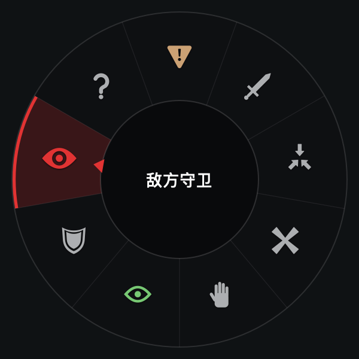
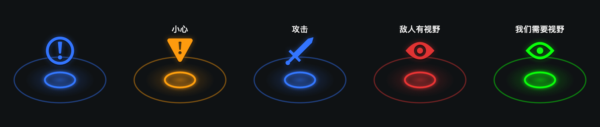
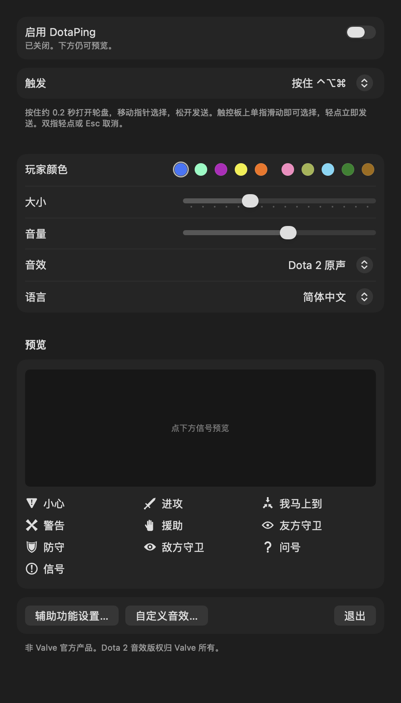
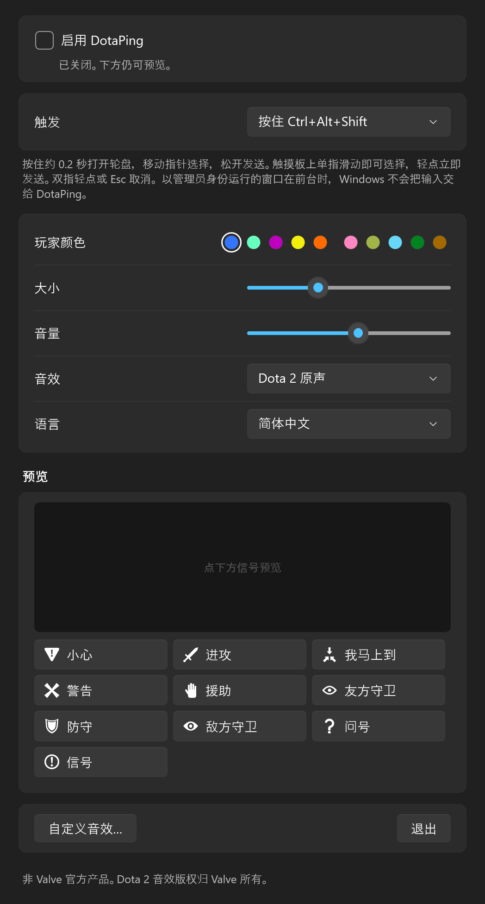

# DotaPing

[English](README.md)

把 Dota 2 的信号轮盘搬到桌面上的小工具，支持 **macOS 和 Windows**。按住快捷键（或像游戏里一样 Alt/⌥ + 点击），指向一个信号，松开，信号就落在起点，带动画和游戏原版提示音。鼠标、触控板都能用。界面默认英文，可切换为简体中文。

本项目基于 **[AllenTHT/LoLPing-Mac](https://github.com/AllenTHT/LoLPing-Mac)**（英雄联盟版本）。macOS 版的应用结构、修饰键手势状态机、覆盖窗口和自检工具改编自该项目；Dota 2 信号内容、图标、音效、触控板处理、Alt/⌥ + 左键触发、双语界面和 Windows 版是新写的。

<p align="center">
  
</p>
<p align="center">
  
</p>
<p align="center">
  
  
</p>

## 下载

从 [Releases](https://github.com/PeixiongYuan/DotaPing-Mac/releases) 下载：

| | 文件 | 要求 |
| --- | --- | --- |
| macOS | `DotaPing-v1.4.0-macOS-arm64.zip` | Apple Silicon，macOS 13 或更新 |
| Windows | `DotaPing-v1.4.0-windows-x64.zip` | Windows 10 或 11（x64；Arm 设备可通过模拟运行），无需安装其他组件 |

界面默认是英文：在设置窗口的 **Language** 一栏选「简体中文」即可切换，立即生效。

### macOS

解压后把 `DotaPing.app` 拖进「应用程序」。应用用本项目自己的自签名证书签名、未经公证；若系统拒绝打开，先尝试打开一次，再到 **系统设置 → 隐私与安全性** 点 **仍要打开**。然后打开「启用 DotaPing」，并在 **系统设置 → 隐私与安全性 → 辅助功能** 中允许 DotaPing。窗口内预览不需要权限。

**从 1.3.0 起，更新版本会保留辅助功能权限。** macOS 按 App 的「代码要求」记住授权。1.2.0 及以前用的是临时签名（ad-hoc），这个要求就是二进制哈希，每个新版本都得移除后重新授权。1.3.0 起所有版本都用同一张证书签名，要求变成「Bundle ID `local.dotaping.DotaPing` + 这张证书」，以后的版本都满足。从 1.2.0 或更早版本升级时，需要最后一次移除旧条目并重新允许；之后直接替换 App 即可。

### Windows

解压后运行 `DotaPing.exe`（单个文件，自带 .NET 运行时，约 70 MB）。程序未做代码签名，SmartScreen 可能提示「Windows 已保护你的电脑」，点 **更多信息 → 仍要运行**。DotaPing 常驻在任务栏右下角的通知区域，点图标打开设置。不需要管理员权限，也没有授权弹窗，首次启动即开启。

- 以 **管理员身份** 运行的窗口在前台时，Windows 不会把键鼠输入交给普通程序，DotaPing 在那时收不到快捷键。
- 覆盖层显示在普通窗口和无边框全屏窗口之上；**独占全屏** 的游戏会盖住它，请改用无边框或窗口模式。
- 设置保存在 `%APPDATA%\DotaPing\settings.json`。

## 使用

| 触发方式 | macOS | Windows | 操作 |
| --- | --- | --- | --- |
| 按住快捷键（默认） | ⌃⌥⌘（或 ⌃⌥⇧、⌃⌘⇧） | Ctrl+Alt+Shift（或 Ctrl+Alt） | 按住约 0.2 秒打开轮盘，移动指针选择，松开任意一键发送；轮盘打开时点按或轻点触控板立即发送。不需要按鼠标键。 |
| 与游戏相同 | ⌥ + 左键 | Alt + 左键 | Alt/⌥ 点按发信号，Ctrl/⌃ + Alt/⌥ 点按发警告，Alt/⌥ 按住左键拖动打开轮盘、松开发送。开启期间这些点击由本程序占用。 |

Esc 或右键取消。信号落在打开轮盘的位置；轮盘贴近屏幕边缘会向内移动，落点不变。关闭窗口后仍在菜单栏或通知区域运行。触发方式、玩家颜色、大小、音量、音效和语言自动保存。软件不添加开机启动项，不联网，不记录键盘输入内容。

### 触控板 / 触摸板

- 按住快捷键时单指滑动即可选择，不用按下；松开按键或轻点发送。
- Alt/⌥ + 左键模式：轻点或按下发信号；按下不松手即打开轮盘，滑动后抬起发送。Mac 上也支持三指拖移。
- 双指轻点（辅助点按）取消。
- 双指滚动和惯性滚动不会打断轮盘，轮盘打开时也不会滚动下方窗口。
- Windows 上，按住 Alt 时点击被本程序占用，松开 Alt 本会激活下方程序的菜单栏；DotaPing 会在中间发送一个未分配的按键来避免这种情况。

## 信号

共 9 格，每格 40°，从正上方开始顺时针排列；中心为普通信号。名称、队伍文字、固定颜色和音效分组取自游戏的 `scripts/ping_wheel.vdata` 与中英文本地化文件。

| 位置 | 信号 | 队伍文字 | English | 颜色 |
| --- | --- | --- | --- | --- |
| 正上 | 小心 | 小心 | Caution | 固定橙色 |
| 40° | 进攻 | 攻击 | Attack | 玩家颜色 |
| 80° | 我马上到 | 前往 | On My Way | 玩家颜色 |
| 120° | 警告 | — | Warning | 玩家颜色 |
| 160° | 援助 | 援助 | Assist | 玩家颜色 |
| 200° | 友方守卫 | 我们需要视野 | Friendly Ward | 固定绿色 |
| 240° | 防守 | 防守 | Defend | 玩家颜色 |
| 280° | 敌方守卫 | 敌人有视野 | Enemy Ward | 固定红色 |
| 320° | 问号 | — | Question Mark | 玩家颜色 |
| 中心 | 信号 | — | Ping | 玩家颜色 |

玩家颜色可选天辉 / 夜魇共十个位置。「问号」是游戏里的「问号？」赛季信号，没有单独的音效和队伍文字，因此使用普通信号音。游戏允许自定义轮盘排列；上表沿用 LoLPing 的方位并在最后加入问号，未核实与游戏默认排列一致。没有加入「爱心」信号。

## 图标与音效

- 图标是矢量重画，能核对到原版的都照原版造型：圆环「!」、两端张开的 X、三箭头汇聚的「我马上到」、剑、顶边带凹口的盾、守卫眼睛、粗体问号。游戏里敌我守卫共用同一个眼睛、只靠颜色区分；这里友方守卫画成描边眼睛，未高亮时也能分清。「小心」和「援助」的标准原版图标找不到公开来源，分别画成倒三角警示（参照游戏的「Caution!」赛季信号）和举起的手。两个平台画的是同一套轮廓：Windows 版使用从 macOS 版导出（`--export-glyphs`）的 `windows/Core/glyphs.json`。
- **音效 → Dota 2 原声**（默认）：播放游戏自带的信号音效。游戏 `sounds/ui/` 下的 8 个原始文件未经修改内置在 `Resources/Sounds/`，取自社区存档 [Source2Sounds/dota2](https://github.com/Source2Sounds/dota2) 的固定提交；`Resources/asset-sources.json` 记录了来源和 SHA-256，`scripts/fetch_sounds.py` 可重新获取。启动时按游戏音效事件的参数混音：各信号音量不同，警告叠加一层升调 1.25 倍的音，进攻叠加一层降调 0.95 倍、延迟 0.1 秒的音。**这些音效文件版权归 Valve Corporation 所有**，与 LoLPing-Mac 一样仅为这个同人小工具而附带。
- **音效 → 合成音效**：改用启动时程序合成的七种提示音。
- 点「自定义音效…」可放入同名文件（`ping`、`ping_warning`、`ping_waypoint`、`ping_attack`、`ping_enemy_ward`、`ping_friendly_ward`、`ping_defense`）替换，下一次信号生效。文件夹：macOS 为 `~/Library/Application Support/DotaPing/Sounds/`（wav / mp3 / m4a / aiff / caf），Windows 为 `%APPDATA%\DotaPing\Sounds\`（wav / mp3 / m4a / wma）。
- 落点动画按 `ping_wheel.vdata` 中的小地图信号参数重建：光圈 0.3 秒收拢并跳动、向外扩散的脉冲、图标浮起并在上方显示队伍文字、最后淡出。是同风格重建，不是逐帧复刻。

## 从源码构建

**macOS**：需要 Command Line Tools（`xcode-select --install`），不需要 Xcode、第三方库或网络。

```sh
zsh scripts/build.sh   # 生成并签名 dist/DotaPing.app
zsh scripts/test.sh    # 手势、数据、语言、图标与音效检查
```

`scripts/build.sh` 第一次运行时会在 `.signing/` 里创建一个自签名代码签名身份（单独的钥匙串文件，不进 git，不改动登录钥匙串和系统信任设置），之后每次构建都用它签名，所以自己编译的版本也会保留辅助功能权限。请保留这个文件夹：换了新身份就需要再授权一次。脚本直接调用 `swiftc`；如果 `swift build` 报 `Invalid manifest`，是 Command Line Tools 残留了旧版 `*.private.swiftinterface`，重装即可，构建脚本不受影响。

**Windows**：需要 .NET 10 SDK，在仓库根目录运行：

```sh
dotnet run --project windows/Checks
dotnet publish windows/App/DotaPing.csproj -c Release -r win-x64 --self-contained true -p:PublishSingleFile=true -p:IncludeNativeLibrariesForSelfExtract=true -p:EnableCompressionInSingleFile=true -o publish
```

`windows/Core` 是从 macOS `PingCore` 移植的共享逻辑，`windows/Checks` 是其测试，`windows/App` 是 WPF 程序（低级键鼠钩子、点击穿透的覆盖窗口、托盘图标、跟随系统 Fluent 主题的设置窗口）。[Windows 工作流](.github/workflows/windows.yml) 会在每次推送到 main 时在 Windows 机器上构建和测试，并把 zip 附加到每个 Release。

## 自检

macOS 用 `--check-assets`、`--visual-check 目录`、`--export-sounds 目录`；Windows 用 `DotaPing.exe --check-assets`、`--visual-check 目录`、`--input-self-test`（后者安装真实钩子，用 `SendInput` 注入键鼠输入，端到端检查六种主要手势）。测试与验证细节见 [README.md](README.md#self-checks) 和 [VERIFICATION.md](VERIFICATION.md)。

## 致谢与声明

- [AllenTHT/LoLPing-Mac](https://github.com/AllenTHT/LoLPing-Mac)：本项目的基础。
- [SteamDatabase/GameTracking-Dota2](https://github.com/SteamDatabase/GameTracking-Dota2)：`ping_wheel.vdata`、轮盘样式表与本地化文本的参考来源，只使用了文字、颜色值和时长。
- [Liquipedia](https://liquipedia.net/dota2/)：其 Dota 2 图片库是图标造型的参考，未复制任何图片。
- [Source2Sounds/dota2](https://github.com/Source2Sounds/dota2)：内置原声文件的来源。

尚未选择开源许可证；部分代码改编自未声明许可证的 LoLPing-Mac。`Resources/Sounds/` 中的文件归 Valve 所有，不在本项目任何许可范围内。DotaPing 是独立项目，与 Valve 无关。Dota 2 是 Valve Corporation 的商标。
