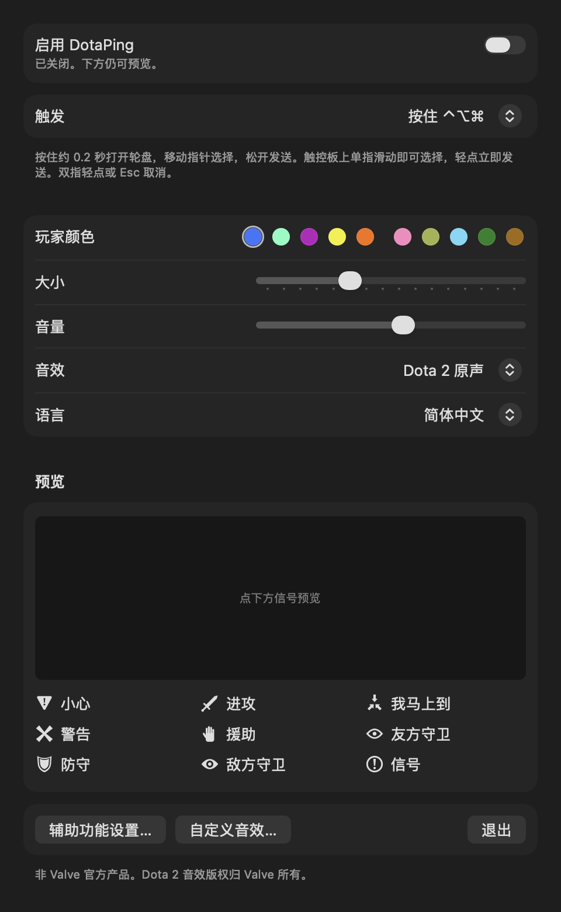

# DotaPing

[English](README.md)

把 Dota 2 的信号轮盘搬到 Mac 桌面上的菜单栏小工具。按住快捷键（或像游戏里一样 ⌥ + 点击），指向一个信号，松开，信号就落在起点，带动画和提示音。鼠标、触控板都能用。播放游戏原版信号音效；界面默认英文，可切换为简体中文。

本项目基于 **[AllenTHT/LoLPing-Mac](https://github.com/AllenTHT/LoLPing-Mac)**（英雄联盟版本）。应用结构、修饰键手势状态机、覆盖窗口和自检工具改编自该项目；Dota 2 信号内容、图标、音效、触控板处理、⌥ + 左键触发和双语界面是新写的。

<p align="center">
  
  
</p>
<p align="center">
  
</p>

## 安装

需要 Apple Silicon Mac、macOS 13 或更新版本。

从 [Releases](https://github.com/PeixiongYuan/DotaPing-Mac/releases) 下载 `DotaPing-v1.1.0-macOS-arm64.zip`，解压后把 `DotaPing.app` 拖进「应用程序」。应用是本地签名、未公证；若系统拒绝打开，先尝试打开一次，再到 **系统设置 → 隐私与安全性** 点 **仍要打开**。

界面默认是英文：在设置窗口的 **Language** 一栏选「简体中文」即可切换，立即生效。然后打开「启用 DotaPing」，并在 **系统设置 → 隐私与安全性 → 辅助功能** 中允许 DotaPing。窗口内预览不需要权限。

## 从源码构建

需要 Command Line Tools（`xcode-select --install`），不需要 Xcode、第三方库或网络。

```sh
zsh scripts/build.sh   # 生成并本地签名 dist/DotaPing.app
zsh scripts/test.sh    # 手势、数据、语言、图标与音效检查
```

脚本直接调用 `swiftc`。如果 `swift build` 报 `Invalid manifest` / `Undefined symbols … Package.__allocating_init`，是 Command Line Tools 的 `usr/lib/swift/pm/ManifestAPI/` 下残留了旧版 `*.private.swiftinterface`，重装 Command Line Tools 即可；构建脚本不受影响。

## 使用

| 触发方式 | 操作 |
| --- | --- |
| **按住 ⌃⌥⌘**（默认，也可选 ⌃⌥⇧、⌃⌘⇧） | 按住约 0.2 秒打开轮盘，移动指针选择，松开任意一键发送；轮盘打开时点按或轻点触控板立即发送。不需要按鼠标键。 |
| **⌥ + 左键**（与游戏相同） | ⌥ 点按发信号，⌃⌥ 点按发警告，⌥ 按住左键拖动打开轮盘、松开发送。开启期间 ⌥ 点按由本程序占用。 |

Esc 或右键取消。信号落在打开轮盘的位置；轮盘贴近屏幕边缘会向内移动，落点不变。关闭窗口后仍在菜单栏运行。触发方式、玩家颜色、大小、音量、音效和语言自动保存。软件不添加登录项，不联网，不记录键盘输入内容。

### 触控板

- 按住快捷键时单指滑动即可选择，不用按下触控板；松开按键或轻点发送。
- ⌥ + 左键模式：轻点（需开启「轻点来点按」）或按下发信号；按下不松手即打开轮盘，滑动后抬起发送。也支持三指拖移。
- 双指轻点（辅助点按）取消。
- 双指滚动和惯性滚动不会打断轮盘，轮盘打开时也不会滚动下方窗口。

## 信号

顺时针，从正上方开始；中心为普通信号。名称、队伍文字、固定颜色和音效分组取自游戏的 `scripts/ping_wheel.vdata` 与中英文本地化文件。

| 位置 | 信号 | 队伍文字 | English | 颜色 |
| --- | --- | --- | --- | --- |
| 上 | 小心 | 小心 | Caution | 固定橙色 |
| 右上 | 进攻 | 攻击 | Attack | 玩家颜色 |
| 右 | 我马上到 | 前往 | On My Way | 玩家颜色 |
| 右下 | 警告 | — | Warning | 玩家颜色 |
| 下 | 援助 | 援助 | Assist | 玩家颜色 |
| 左下 | 友方守卫 | 我们需要视野 | Friendly Ward | 固定绿色 |
| 左 | 防守 | 防守 | Defend | 玩家颜色 |
| 左上 | 敌方守卫 | 敌人有视野 | Enemy Ward | 固定红色 |
| 中心 | 信号 | — | Ping | 玩家颜色 |

玩家颜色可选天辉 / 夜魇共十个位置。游戏允许自定义轮盘排列；上表沿用 LoLPing 的方位，未核实与游戏默认排列一致。没有加入「爱心」信号。

## 图标与音效

- 图标是矢量重画，能核对到原版的都照原版造型：圆环「!」、两端张开的 X、三箭头汇聚的「我马上到」、剑、顶边带凹口的盾、守卫眼睛。游戏里敌我守卫共用同一个眼睛、只靠颜色区分；这里友方守卫画成描边眼睛，未高亮时也能分清。「小心」和「援助」的标准原版图标找不到公开来源，分别画成倒三角警示（参照游戏的「Caution!」赛季信号）和举起的手。
- **音效 → Dota 2 原声**（默认）：播放游戏自带的信号音效。游戏 `sounds/ui/` 下的 8 个原始文件未经修改内置在 `Resources/Sounds/`，取自社区存档 [Source2Sounds/dota2](https://github.com/Source2Sounds/dota2) 的固定提交；`Resources/asset-sources.json` 记录了来源和 SHA-256，`scripts/fetch_sounds.py` 可重新获取。启动时按游戏音效事件的参数混音：各信号音量不同，警告叠加一层升调 1.25 倍的音，进攻叠加一层降调 0.95 倍、延迟 0.1 秒的音。**这些音效文件版权归 Valve Corporation 所有**，与 LoLPing-Mac 一样仅为这个同人小工具而附带。
- **音效 → 合成音效**：改用启动时程序合成的七种提示音（`Sources/PingCore/SoundSynth.swift`）。
- 点「自定义音效…」可打开 `~/Library/Application Support/DotaPing/Sounds/`，放入同名文件（`ping`、`ping_warning`、`ping_waypoint`、`ping_attack`、`ping_enemy_ward`、`ping_friendly_ward`、`ping_defense`，wav / mp3 / m4a / aiff / caf）即可替换，下一次信号生效。
- 落点动画按 `ping_wheel.vdata` 中的小地图信号参数在 AppKit 里重建：光圈 0.3 秒收拢并跳动、向外扩散的脉冲、图标浮起并在上方显示队伍文字、最后淡出。是同风格重建，不是逐帧复刻。

## 自检

```sh
dist/DotaPing.app/Contents/MacOS/DotaPing --check-assets
dist/DotaPing.app/Contents/MacOS/DotaPing --visual-check "$PWD/Verification/Visuals"
dist/DotaPing.app/Contents/MacOS/DotaPing --export-sounds /tmp/dotaping-sounds
```

测试与验证细节见 [README.md](README.md#self-checks) 和 [VERIFICATION.md](VERIFICATION.md)。

## 致谢与声明

- [AllenTHT/LoLPing-Mac](https://github.com/AllenTHT/LoLPing-Mac)：本项目的基础。
- [SteamDatabase/GameTracking-Dota2](https://github.com/SteamDatabase/GameTracking-Dota2)：`ping_wheel.vdata`、轮盘样式表与本地化文本的参考来源，只使用了文字、颜色值和时长。
- [Liquipedia](https://liquipedia.net/dota2/)：其 Dota 2 图片库是图标造型的参考，未复制任何图片。
- [Source2Sounds/dota2](https://github.com/Source2Sounds/dota2)：内置原声文件的来源。

尚未选择开源许可证；部分代码改编自未声明许可证的 LoLPing-Mac。`Resources/Sounds/` 中的文件归 Valve 所有，不在本项目任何许可范围内。DotaPing 是独立项目，与 Valve 无关。Dota 2 是 Valve Corporation 的商标。
